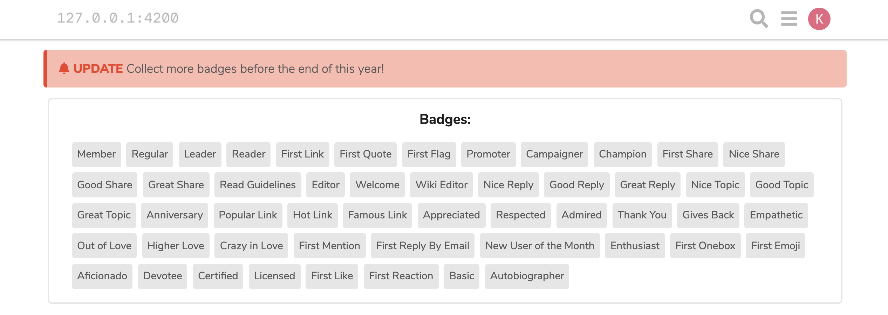

# Example Component

This theme component showcases some advanced techniques to use when developing theme components on Discourse.



## This theme component has examples for the following topics:

### :electric_plug: Using a plugin-outlet and adding markup within the outlet

1. Use the [plugin outlet theme component](https://meta.discourse.org/t/plugin-outlet-locations-theme-component/100673) to identify where plugin outlets exist. If there isn't one that you have, submit a pull-request to the [Discourse codebase](https://github.com/discourse/discourse) to add your own.
2. Create a folder inside `javascripts/discourse/connectors/`with the plugin-outlet name (ex `below-site-header`)
3. Create a `.hbs` file with a unique name
   [/details]
4. Add markup in handlebars file

https://github.com/mentorchains/example-component/commit/848b1fb67c01483bee9fa14c8455566ab98a5acf

### :art: Add styling to your connector template

Add your own custom styling in `common/common.scss`. Also, feel free to add Discourse's existing classes to your HTML code. For example, I am using Discourse's existing <ins>`.wrap`</ins> class to center my markup.

https://github.com/mentorchains/example-component/commit/167cfaeb898f4ab1283d24e638fab70f0bfe686a?branch=167cfaeb898f4ab1283d24e638fab70f0bfe686a&diff=unified

### :large_blue_circle: Adding Font Awesome Icons

Here I am adding <ins>`{{d-icon "bell"}}`</ins> to my handlebars file to include the Font Awesome bell icon (sourced [here](https://fontawesome.com/v5.15/icons/bell?style=solid)). To ensure I have the dependency for this icon, I add it to my modifiers in my about.json file. I can also style its color in my scss by targeting the svg selector. For more details about adding Font Awesome icons to your theme components, [see this topic](https://meta.discourse.org/t/introducing-font-awesome-5-and-svg-icons/101643).

https://github.com/mentorchains/example-component/commit/5dc8b8187eaad05bd21c980a3de5c9e58dc7b202

### :capital_abcd: Changing text to a localizable string

We want to avoid hard-coding our text in the template. As a result, I will make our text use a localizable string. This is declared in the `locales` folder with a yaml file denoting which language you wish to use. In our case, `en.yml`. After adding our string, we can use it with the syntax <ins>`{{theme-i18n "string_variable"}}`</ins>. For more details on localizable strings [see this topic.](https://meta.discourse.org/t/adding-localizable-strings-to-themes-and-theme-components/109867)

https://github.com/mentorchains/example-component/commit/abedd95197a54f52b2fef3d9034de9e24833699b

### :gear: Adding a custom setting

We can define setting that can be configured in the admin panel. Here we are adding a custom setting that changes the notification type. We do this in the `settings.yml` file and declare it using the syntax <ins>`{{theme-setting "setting_string"}}`</ins>. [Click here](https://meta.discourse.org/t/how-to-add-settings-to-your-discourse-theme/82557) for more information about adding settings to your Discourse themes.

https://github.com/mentorchains/example-component/commit/e8da90d5ba368259aaa6875e50df01983f5d0bd6

### :electric_plug: Adding JS code to a connector

We can also add JavaScript code to our plugin-outlet connectors. To do this we can use the pluginAPI in the initializer. Specifically, we will use the method, `api.registerConnectorClass()` to target the outlet we wish to add a connector to. Here I am adding a connector to the `below-site-header` plugin outlet.

https://github.com/mentorchains/example-component/commit/ebb0f2686b8f1ce898e0283523158ca0df04aaf4

### :computer: Accessing Data from API Endpoints

Discourse has various end-points available to the front-end. For example, https://localhost:4200/badges.json will give us badge data. We can fetch that data using the `ajax` method Discourse has for us.

First make sure to import it:

- <ins>`import { ajax } from 'discourse/lib/ajax';`</ins>

Next use the ajax method:

```js
ajax('badges.json').then((badgeData) => {
  // fetch your badges here and put it in a component with the setupComponent method, which can be used in your handlebars file
});
```

https://github.com/mentorchains/example-component/commit/095f90de04353bde386a3b75efcab4eea783d368
